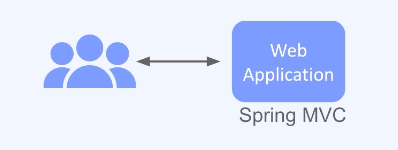
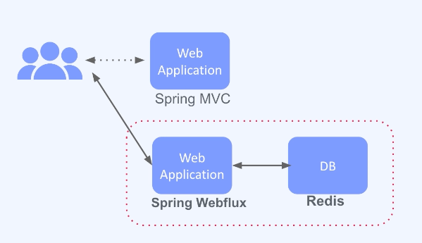
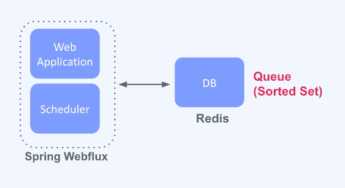
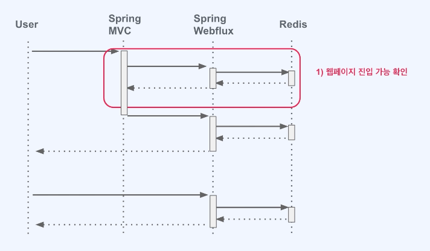
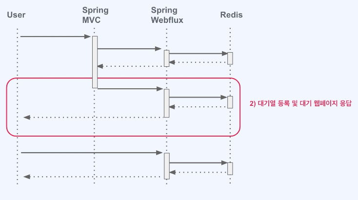
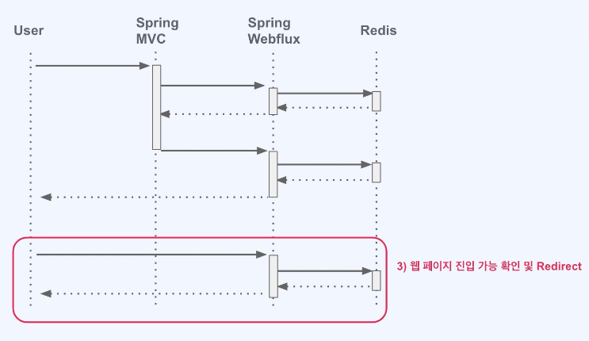
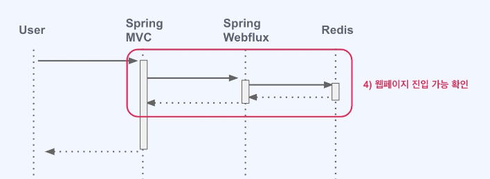

### 아키텍처 

### spring mvc 기반으로 타켓 웹페이지를 준비

### 접속자 대기열 시스템 준비
- 대기 이후 타켓 홈페이지 로 이동
- WebFlux 와 Redis 가 필요

### 프로젝트에서
- redis
  - 인 메모리의 성능 뿐만 아니라, 접속자를 관리하기 위한 Queue 로 활용하기 위함
  - 특히나 spring webflux 가 수평 확장의 경우 redis 를 통해 단일 queue 로써 운영이 가능하기 때문이다.
- Scheduler
  - 특정 주기로 3, 5, 10 대기열에 있는 사용자를 접속 가능케 하는 역할을 가진다.
  - 그로인해 target Page 로 이동하게 된다.

### flow 
> 1. spring mvc 에서 대기열 시스템에 api 서버로 질의후 진입이 가능한지 확인한다.

> 2. 진입이 허용되지 않을경우 spring web flux 로 대기를 위한 web 페이지 요청을 진행  
> 이 과정에서 대기열로 등록을 하고 대기를 위한 webPage 를 사용자에게 제공한다.  

> 3. 대기를 위한 webPage 에 머문 사용자는 주기적으로 접송 가능여부를 api 서버로 질의를 하게 된다.
> 이때 spring web flux 에서는 redis 에 질의하여 접속 가능한 상태인지 확인하고 응답을 하게 된다.
> 스케줄러 가 주기적으로 대기열에 있는 사용자를 접속 가능케 설정하게 된다.

> 4. 접속 가능한 상태가 되면 대기 페이지는 재 진입을 하게 된다
> 처음과 같이 api 서버로 질의후 진입 가능시, 원래 가고자 했던 페이지로 이동하게 된다.

